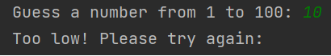

# :question::question::question: Game "Guess a Number" :question::question::question:

---
> Description : This is simple one player console game, written on Java language.
---
## :point_right: Introduction
In this version of the game "Guess a Number" you play versus the computer (your opponent).
The main goal of the game is to guess a number from 1 to 100 that the computer has chosen randomly beforehand.

---

## :point_right: Rules
The rules in this game are simple: Player choose a number from 1 to 100. 
Then receive answer whether the number is less than, greater than, or equal to the number chosen by the computer.

Image Credits : Google

---

## :point_right: Gameplay
When the game start you will be able to choose a number from 1 to 100.
* Choose a number and press enter

On the next line you will see if you guessed the number and a guideline for choosing the next number.
Then you will choose another number.

If you input something different from number from 1 to 100, you will get a reply for wrong input.

---

## Algorithm

1. User choice will be taken and stored.
2. The computer will choose a random number from 1 to 9.
    * If computer choose a number from 1 to 33, it will equal to Rock.
    * If computer choose a number from 34 to 66, it will equal to Paper.
    * If computer choose a number from 67 to 99, it will equal to Scissors.
3. The user input will be compared with computer choice.
4. According to rules one of the players will win.
5. The winner will be written on the console.
6. Player choice for new game will be taken.

---

## :point_right: Live Demo

[Link to live demo]()